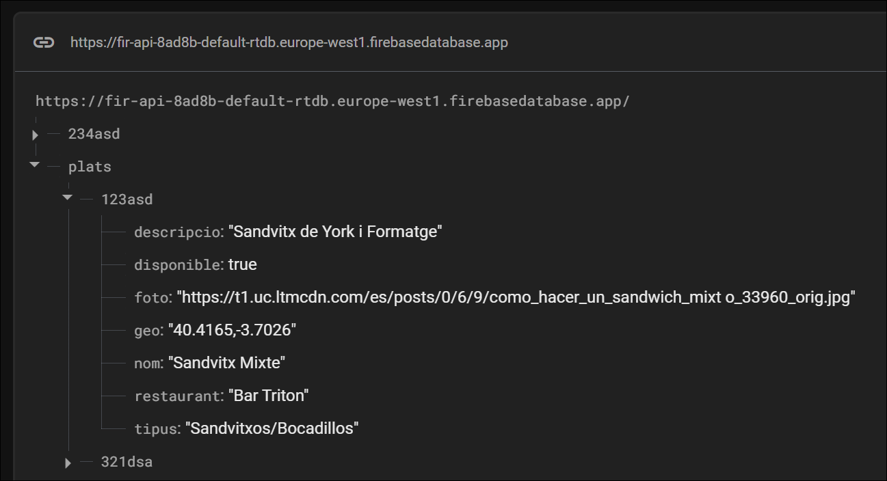

# examen_PMDM

## Firebase - https://firebase.google.com/
go to console --> crear proyecto
Compilacion --> Realtime DDBB --> Crear una BBDD

Consulta postman https://fir-api-8ad8b-default-rtdb.europe-west1.firebasedatabase.app/plats.json

## JSON:
https://app.quicktype.io/
Generar el jSON

## class models/plats.dart